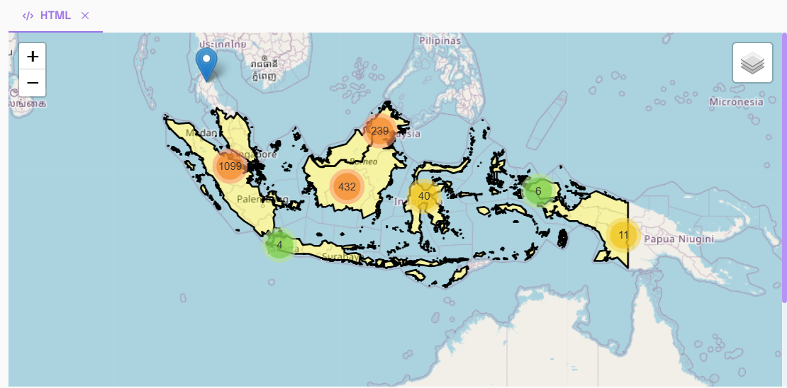

# GeoIA Examples

This repository showcases the capabilities of current technologies in automating various geospatial processes. It focuses on generating statistical analyses and spatial visualizations, including outputs such as interactive maps, graphical representations, and base cartography. By leveraging large language models (LLMs) and specialized libraries, the repository provides efficient solutions for everyday geospatial tasks.

> **⚠️ Warning**:  
> Examples 1 and 3 will be completed using [Vizly](https://vizly.fyi/app), and Example 3 will be completed using Jupyter Notebooks.

# 1. Administrative limits map for the Valle del Cauca Region in Colombia

The material for this exercise con be found in the folder nameed [Example_one](./Example_one)

> The [Mun_valle.zip](./Example_one/Mun_valle.zip) contains a shapefile that is related to the municipality division in the
> department of Valle del Cauca in Colombia. The dataset was downloaded from [Colombia in Maps](https://www.colombiaenmapas.gov.co/), 
> which is the official portal for geographic and cadastral information of the country. 

In this first example we are going to show you how you can elaborate a location map:


### **🚨Promp 1:**

### **🚨Promp 2:**

## **🚨Promp 1:**
 
# 2. Palm Oil Mills in Indonesia and Malaysia

The material for this exercise can be found in the folder named [Example_Two](./Example_two).

The [gadm_countries.gpkg](./Example_one/gadm_countries.gpkg) file was generated using the [GADM official data](https://gadm.org/download_world.html) and was processed using the following [ogr2ogr](https://gdal.org/programs/ogr2ogr.html) command:

```bash
ogr2ogr -f GPKG c:\..\gadm_country.gpkg c:\..\gadm_410.gpkg -nln "gadm_country" -nlt MULTIPOLYGON -dialect sqlite -sql "SELECT NAME_0 AS country_name, ST_SimplifyPreserveTopology(ST_Union(geom),0.05) AS geom FROM gadm_410 GROUP BY country_name" -explodecollections
```

### **🚨Promp 1:**
> I am working on a geospatial data visualization project and need a Python script to load and process information 
> about palm oil mills in Malaysia and Indonesia. The script should load a CSV file from the following 
> URL: https://raw.githubusercontent.com/juliocollazos/geoia_examples/main/Example_two/UML_data.csv. This file contains 
> relevant information such as 'Mill Name,' 'RSPO Status,' 'Latitude,' 'Longitude,' and 'Country.'
>
> The script should convert the 'Latitude' and 'Longitude' columns to numeric values and remove columns containing 
> invalid (NaN) values in these coordinates. Then, it should filter the DataFrame to include only the rows where the 
> 'Country' column is 'Malaysia' or 'Indonesia.' The filtered data should be converted into a GeoDataFrame using 
> GeoPandas, transforming the 'Longitude' and 'Latitude' columns into point geometries with the 
> EPSG:4326 coordinate system.
> 
### **🚨Promp 2:**
> Next, the script should load the country boundaries from a GeoPackage file located 
> at https://github.com/juliocollazos/geoia_examples/raw/main/Example_two/gadm_country.gpkg. 
> This file contains a column called 'country_name', which should be used to filter the boundaries to 'Malaysia' 
> and 'Indonesia'. 

### **🚨Promp 3:**
> Once the data processing is complete, the script should create an interactive map using Folium. 
> The map should be centered on the average coordinates of the 'Latitude' and 'Longitude' columns from the 
> filtered points, with an initial zoom level of 4 and using OpenStreetMap tiles. On the map, the country boundaries 
> should be added as a layer named 'Country Boundaries', with a black border ('color': 'black') and a yellow fill 
> with 30% opacity ('fillColor': 'yellow', 'fillOpacity': 0.3). The country name ('country_name') should appear as a 
> popup when clicking on the respective area on the map.
>
> In addition, the script should create a MarkerCluster named 'Palm Oil Mills' to group the points corresponding 
> to the mills. For each mill, a marker should be added to the MarkerCluster that displays a popup containing 
> the mill's name ('Mill Name'), its RSPO certification status ('RSPO Status'), and the country ('Country').
> Once the script is generated, it should be executed.

### The result will be something like this:


Or you can see the results as well in this [Jupyter Notebook](Example_two/Example_one.ipynb)

# 3. Réunion tree cover loss analysis

> The material for this exercise can be found in the folder named [Example_three](./Example_three)
>
> This example is based on [Hansen dataset](https://storage.googleapis.com/earthenginepartners-hansen/GFC-2023-v1.11/download.html) 
> updated for the 2023. The information is presented as a Geopackage (GPKG) and contains 4 files, forest2016, forest2024, defo2016_2023 and admin_levels.

### **🚨Promp 1:**
> My team and I are working on a geospatial data analysis that consist in calculate and visualize the probability of cover loss in
> the first administrative level of the Reunion country, for this we select the Hansen dataset that contains information about
> tree canopy cover for 2000, tree cover loss since 2000 to 2023 and other layers that we don't considered to use for this analysis. 
> Generate a script for load this geopackage file 
> 

# 4. Using geoai in python
