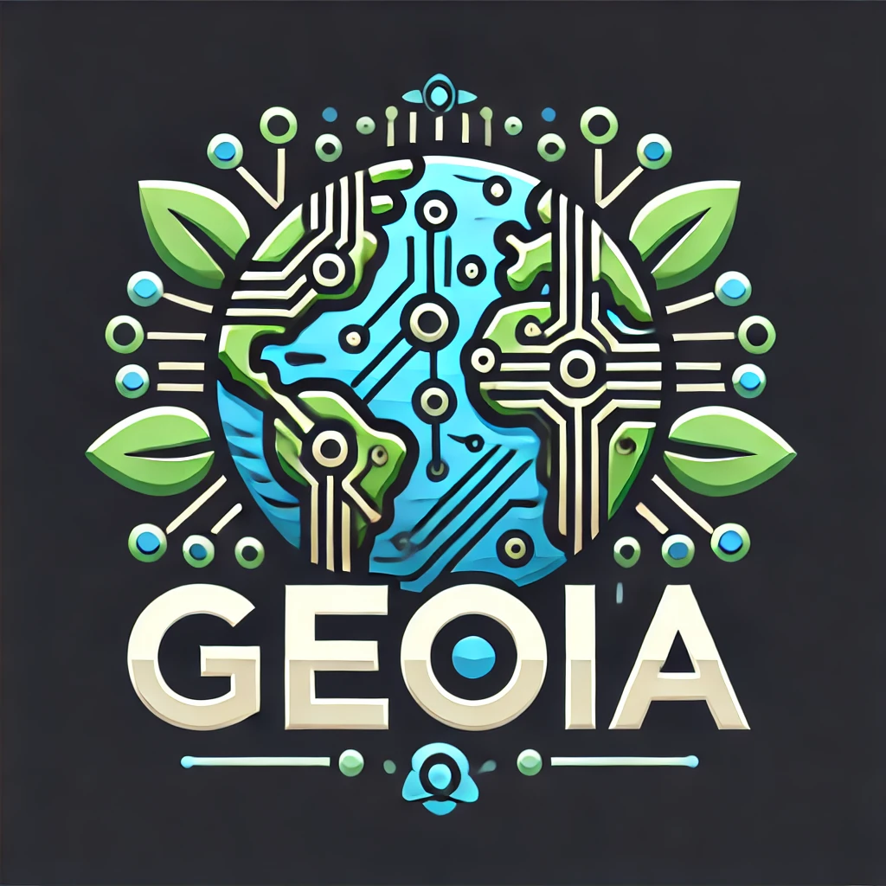

# GeoIA Examples
#### ⚠️ Arreglar introducción
#### This repository aims to show several of the current functionalities for various geographic processes with the ability to automate through the use of LLMs and libraries that provide functionalities in everyday tasks such as land cover classification.
> **⚠️Warning**:
> The examples 1 and 2 will be worked out using [Vizly](https://vizly.fyi/app) 
> and the example three will be worked out using a Jupyter Notebook

## Example one - Universal Mill List interactive dashboard
> The material for this exercise can be found in the folder named [Example_One](./Example_one)
##### The [gadm_countries.gpkg](./Data/gadm_countries.gpkg) was generated using the [GADM oficial data](https://gadm.org/download_world.html) and executing the following ogr2ogr command:
```bash
ogr2ogr -f GPKG c:\..\gadm_country.gpkg c:\..\gadm_410.gpkg -nln "gadm_country" -nlt MULTIPOLYGON -dialect sqlite -sql "SELECT NAME_0 AS country_name, ST_SimplifyPreserveTopology(ST_Union(geom),0.05) AS geom FROM gadm_410 GROUP BY country_name"  -explodecollections
```
>**🚨Promp 1:**
>

## Example 2 - Réunion tree cover loss analysis
> The material for this exercise can be found in the folder named [Example_two](./Example_two)
> 

## Example 3 - Using geoai in python
ogr2ogr -f GPKG 
